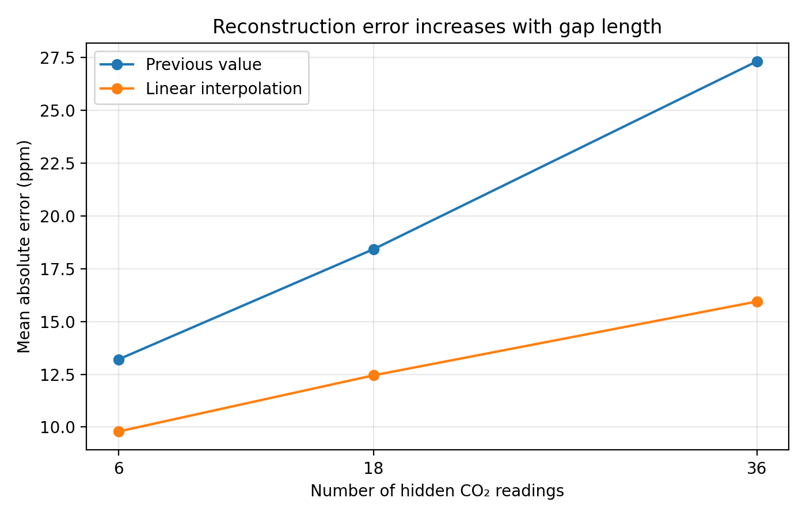

# Reconstructing missing indoor CO₂ sensor readings

## Engineering question

How accurately can short gaps in indoor CO₂ sensor measurements be reconstructed using numerical interpolation, and how does accuracy change as the missing interval gets longer?

Reliable CO₂ measurements help assess indoor air quality. This project studies offline reconstruction: readings on both sides of a gap are available before the missing values are estimated.

## Data and inputs

Source: MMA3001 Dataset 2, Monash Smart Infrastructure environmental sensor data. The analysis uses sensor `6012002000869` and CO₂ readings measured in parts per million (ppm).

The input is the original environmental sensor ZIP containing a CSV file. `src/evaluate.py` extracts CO₂ values and their Unix timestamps, keeps one value per timestamp, and orders the readings by time. The audit found 29,341 CSV rows for this sensor and 13,800 distinct CO₂ timestamps. The original dataset ZIP is kept outside this public repository.

## Methods

- **Previous value:** repeat the last observed CO₂ value throughout the gap.
- **Linear interpolation:** estimate each missing value using its timestamp and the observed values immediately before and after the gap.

`src/reconstruct.py` implements both methods. Its inputs are the two observed timestamps and values, the missing timestamps, and the method name. Its output is a list of estimated CO₂ values in ppm. It rejects timestamps outside the gap and unknown method names.

## Validation and results

Known readings were temporarily hidden and then compared with the reconstructed values. The final evaluation uses the middle 25% of the time-ordered readings. It tests gaps of 6, 18, and 36 hidden readings, leaves space between tested gaps, and excludes windows containing an existing break longer than 30 minutes.

Mean absolute error (MAE) and root mean square error (RMSE) are reported in ppm. Lower values indicate more accurate estimates.

| Hidden readings per gap | Tested gaps | Previous MAE | Linear MAE | Previous RMSE | Linear RMSE |
| ---: | ---: | ---: | ---: | ---: | ---: |
| 6 | 246 | 13.20 | 9.79 | 17.45 | 12.50 |
| 18 | 132 | 18.42 | 12.45 | 25.36 | 16.20 |
| 36 | 78 | 27.30 | 15.94 | 38.00 | 21.00 |



Linear interpolation had lower error at all three tested gap lengths. Both methods became less accurate as the number of hidden readings increased. The gap sizes count readings, not fixed durations: measurement intervals vary. Linear interpolation requires a valid observation after the gap, so it is intended for offline reconstruction rather than immediate prediction of future readings.

## Run the analysis

With Python 3 installed, obtain the original Dataset 2 environmental sensor ZIP separately. From the repository's main folder, run:

```bash
python src/audit.py path/to/environment.zip
python src/evaluate.py path/to/environment.zip
python -m unittest discover -s tests -v
